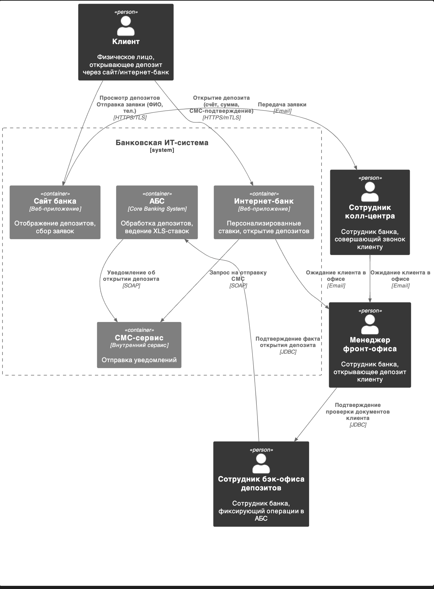
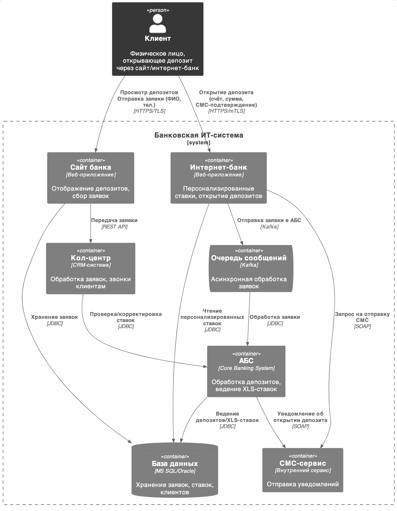

### **Название задачи:** 
### **Автор:**
### **Дата:**
### **Функциональные требования**
Опишите здесь верхнеуровневые Use Cases. Их нужно оформить в виде таблицы с пошаговым описанием:

|**№**|**Действующие лица или системы**|**Use Case**|**Описание**|
| :-: | :- | :- | :- |
|1|Клиент, Менеджер колл-центра, Специалист фронт-офиса, Специалист бэк-оиса депозитов|Открытие депозита через сайт|1.Клиент отправляет заявку через сайт|
||||2.Менеджер колл-центра обрабатывает заявку и связывается с клиентом по телефону|
||||3.Клиент приходит в офис и специалист фронт-офиса обрабатывает заявку|
||||4.Специалист бэк-офиса депозитов обрабатывает заявку в АБС|
|2|Клиент,  Специалист фронт-офиса, Специалист бэк-оиса депозитов|Открытие депозита через ЛК|1.Клиент отправляет заявку через ЛК|
||||2.Клиент приходит в офис и специалист фронт-офиса обрабатывает заявку|
||||3.Специалист бэк-офиса депозитов обрабатывает заявку в АБС|
### **Нефункциональные требования**
Опишите здесь нефункциональные требования и архитектурно-значимые требования.

|**№**|**Требование**|
| :-: | :- |
|1.|Использовать существующие в компании технологии или компетенции.|
|2.|Все скрвисы должны быть доступны 24/7 99,99% времени.|
|3.|Скорость ответа на любое действие пользователя с сайтом и ЛК должна выражаться в милисекундах.|
|4.|Использовать существующий дизайн.|
### **Решение**

### **Альтернативы**

**Недостатки, ограничения, риски**

Решение в рамках MVP подразумевает существенное количество ручных операций. Альтернативное решение более автоматизировано.

