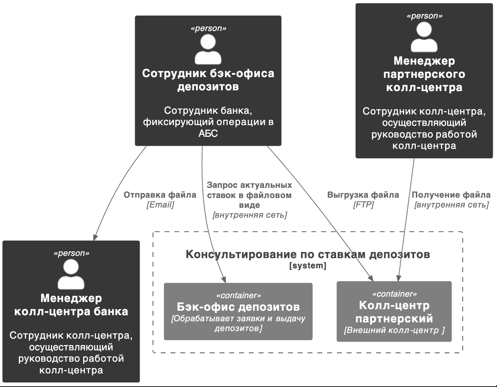
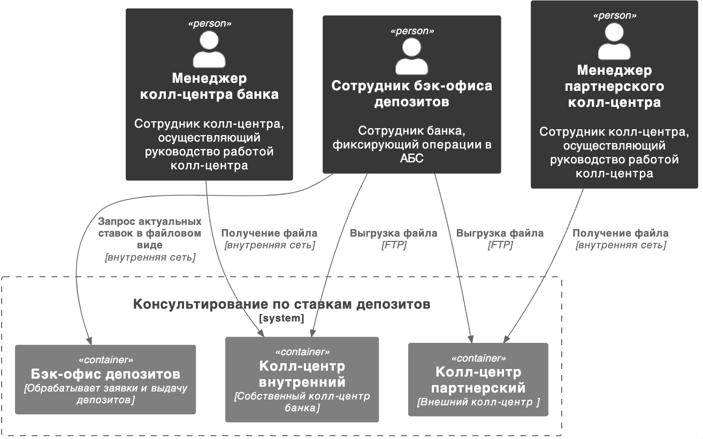
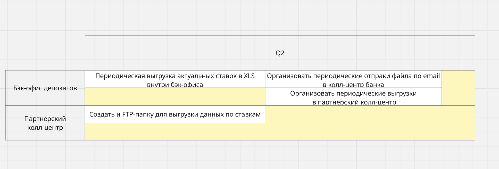

### **Название задачи:** Подключение информации о ставках ко всем колл-центрам
### **Автор: Степан Дильман**
### **Дата: 09.09.2025**
### **Функциональные требования**
Опишите здесь верхнеуровневые Use Cases. Их нужно оформить в виде таблицы с пошаговым описанием:

|**№**|**Действующие лица или системы**|**Use Case**|**Описание**|
| :-: | :- | :- | :- |
|1|Руководитель колл-центра банка, Оператор бэк-офиса депозитов|Актуализация данных|1.Оператор бэк-офиса отправляет актуальный XLS-файл по внутренней электронной почте руководителю колл-центра|
||||2.Руководитель колл-центра доводит информацию до сотрудников|
|2|Руководитель партнерского колл-центра, Оператор бэк-офиса депозитов|Актуализация данных|1.Оператор бэк-офиса отправляет актуальный XLS-файл по защищенному каналу на FTP-папку колл-центра||
||||2.Руководитель колл-центра доводит информацию до сотрудников|
### **Нефункциональные требования**
Опишите здесь нефункциональные требования и архитектурно-значимые требования.

|**№**|**Требование**|
| :-: | :- |
|1.|Передача данных должна идти через файлы.|
|2.|Передача данных должна идти по защищенным каналам.|

### **Решение**

### **Альтернативы**

**Недостатки, ограничения, риски**

Альтернативное решение имеет плюс в том, что схема взаимодействия едина для обоих колл-центров. Минус его в том, что взаимодействие с собственный колл-центром усложнено.

**Road Map**
